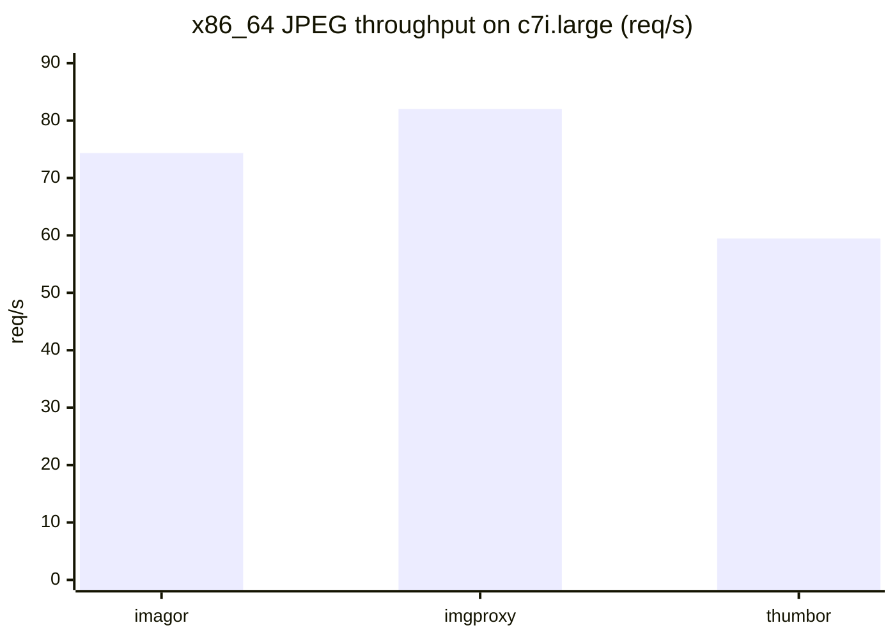
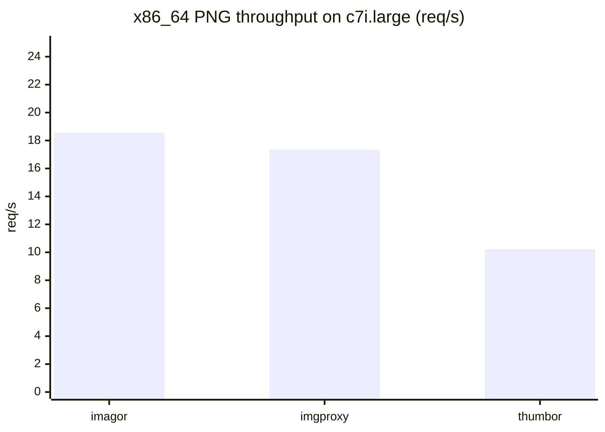
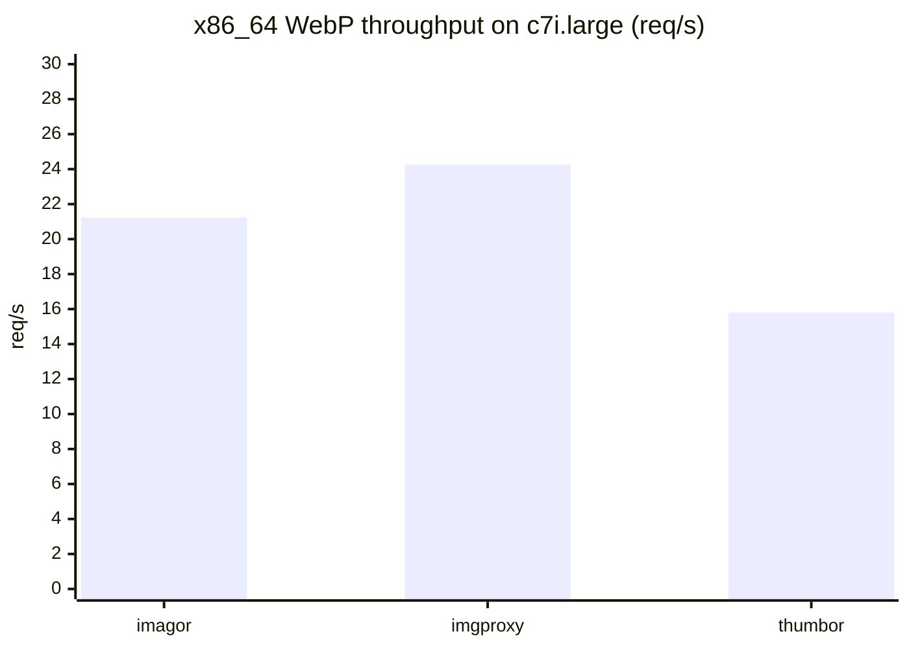
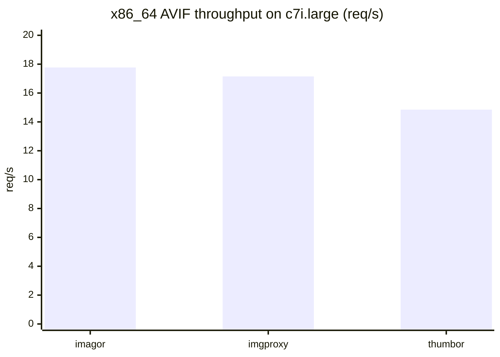

# Benchmarks

imagor is one of the fastest image processing servers available today.

That result comes from the combination of [libvips](https://github.com/libvips/libvips), Go binding [vipsgen](https://github.com/cshum/vipsgen), and imagor's streamed processing path. imagor keeps the request path close to libvips, avoids unnecessary buffering and copies for common streamed inputs, and exposes a libvips-friendly source path that works well for resize and thumbnail workloads.

## Why imagor is fast

imagor uses libvips for image processing and [vipsgen](https://github.com/cshum/vipsgen) for low-level libvips integration from Go. vipsgen provides generated, type-safe libvips bindings with streaming support, which helps keep the integration robust while staying close to libvips. For streamed sources, imagor keeps the data path efficient before the image even reaches the processing stage.

In practice, the main speed advantages come from a few places:

- imagor prepares streamed inputs in a way that libvips can consume efficiently
- blob reuse reduces avoidable reader churn after content sniffing and source preparation
- fanout and shared-reader handling reduce duplicated work around streamed sources
- the seekable libvips source path lets libvips load and process common inputs more efficiently
- libvips itself is highly optimized for resize, thumbnail, and transcode workloads

## Current benchmark summary

The current benchmark summary on this page is based on the committed x86_64 AWS rerun documented in the [benchmark results](https://github.com/cshum/image-servers-benchmark/tree/master/results).

This page highlights the x86_64 run on AWS EC2 `c7i.large`. On this benchmark set, imagor 1.9.1 is consistently faster than thumbor overall and competitive with imgproxy.

Quick x86_64 comparison on AWS EC2 `c7i.large`:

  

JPEG:

  

  

PNG:

  

  

WebP:

  

  

AVIF:

  

- JPEG: imgproxy leads on x86_64 in this setup
- PNG: imagor leads on x86_64
- WebP: imgproxy leads on x86_64
- AVIF: imagor is slightly ahead of imgproxy on x86_64 in this setup

Benchmark shape:

- AWS EC2 `c7i.large`
- `2 VUs`, `5m`, `10s` warmup
- resize to `512x512`
- compared runtimes:
  - imagor: `ghcr.io/cshum/imagor:1.9.1`
  - imgproxy: benchmark harness used `darthsim/imgproxy:latest`
  - thumbor: local `benchmark-thumbor:latest`, resolved from `thumbor/Dockerfile` to `thumbor 7.7.7`

Representative x86_64 throughput from the committed summaries:

| Format | imagor | imgproxy | thumbor |
| --- | ---: | ---: | ---: |
| JPEG | 74.35 req/s | 82.01 req/s | 59.45 req/s |
| PNG | 18.56 req/s | 17.35 req/s | 10.23 req/s |
| WebP | 21.23 req/s | 24.27 req/s | 15.80 req/s |
| AVIF | 17.77 req/s | 17.15 req/s | 14.85 req/s |

The exact ranking still depends on image format, output settings, source shape, and deployment environment. The measured result from the current benchmark set is that imagor is one of the fastest image processing servers, clearly ahead of thumbor overall and competitive with imgproxy across common formats.

## Notes

- imagor and imgproxy are both libvips-based, so the gap is often determined by request-path overhead, source handling, and encoder settings rather than by the core image library alone
- thumbor remains a strong compatibility reference, but its Pillow-based pipeline is generally slower on this workload
- for AVIF, encoder settings matter a lot; benchmark conclusions should always be read together with the exact runtime configuration